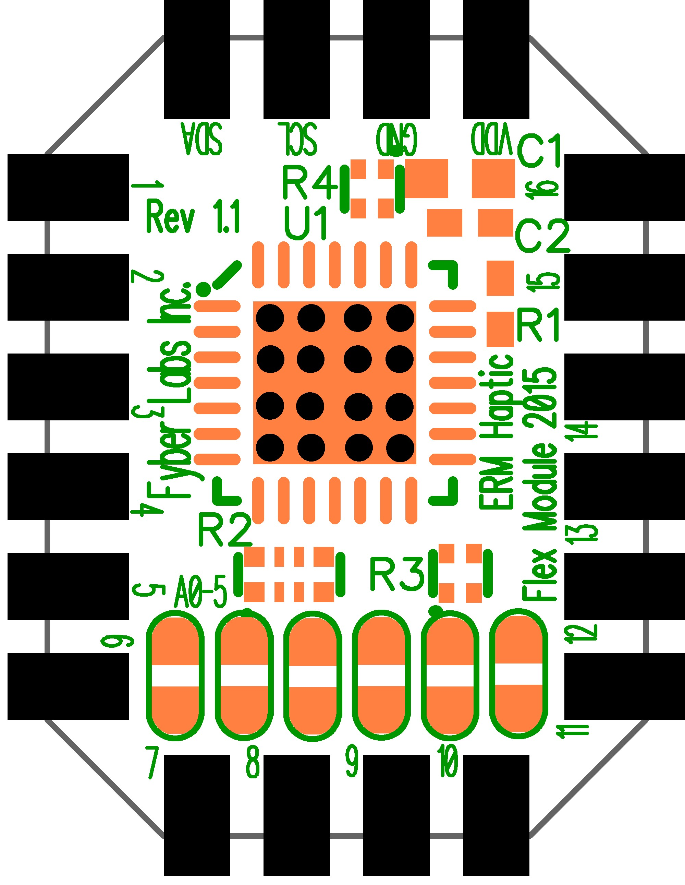
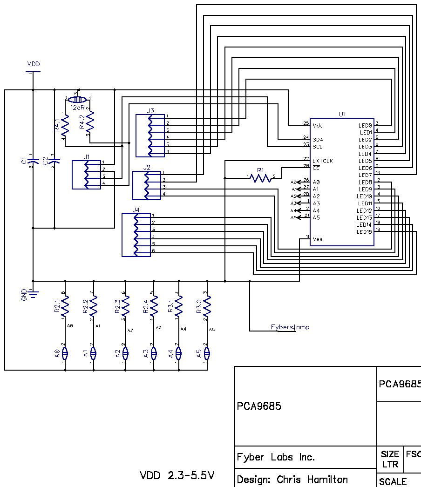
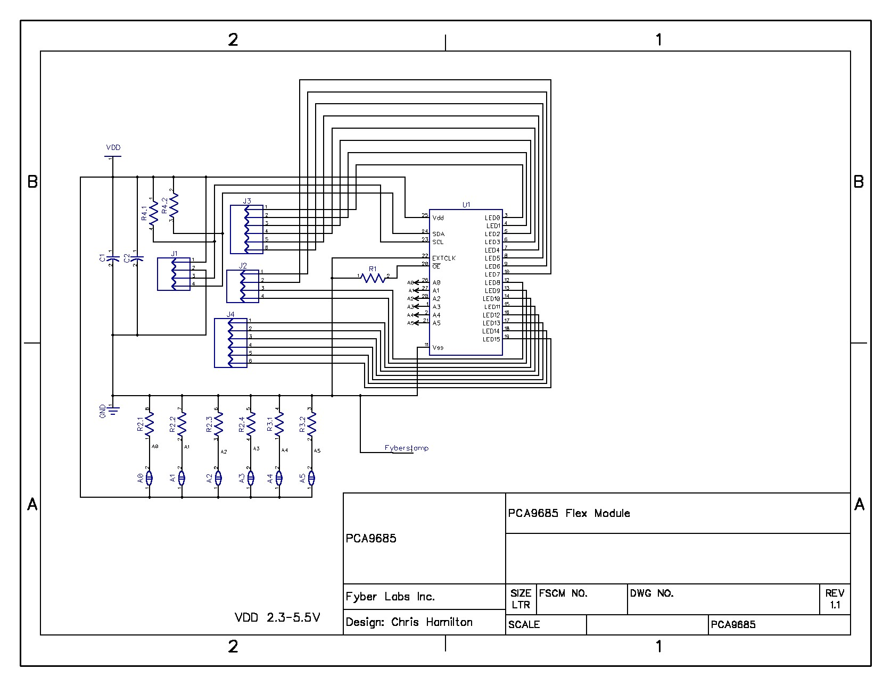

PCA9685 ERM Haptic Flex Module
========

### [**Buy this Flex Module now!**](https://www.tindie.com/products/Fyberlabs/16ch-erm-haptic-flex-module/)

A Flex Module is a tiny breakout board that is both breadboard-able and designed to solder/epoxy to flexible PCB for wearable prototyping.  

This is a PCA9685 in a Flex Module. The driver is configured to source 10mA per channel. In this configuration it can drive 16 LEDs that can utilize 10mA as well as drive servos utilizing PWM. In addition, with common ULN2803A Darlington arrays it can source vibration or other 100mA motors.

This Flex Module will work with any ERM motor sold by [Fyber Labs](https://www.fyberlabs.com).

## [->Project Blog](https://hackaday.io/project/2829-pca9685-erm-haptic-driver-flex-module)
This is the hardware design repository from [Fyber Labs](https://www.fyberlabs.com).  Click on the link for 
more information on the ongoing development.

## [->Flex Modules Blog](https://hackaday.io/project/2236-flex-modules)
This project is part of the Flex Modules being developed for general wearable designs.  CLick on the 
link for more information about Flex Modules and demo projects utilizing Flex Modules like this.

## Layout:

## Bill Of Materials:

## Schematic:

## **Software available:**

- [Adafruit Arduino compatible]()
