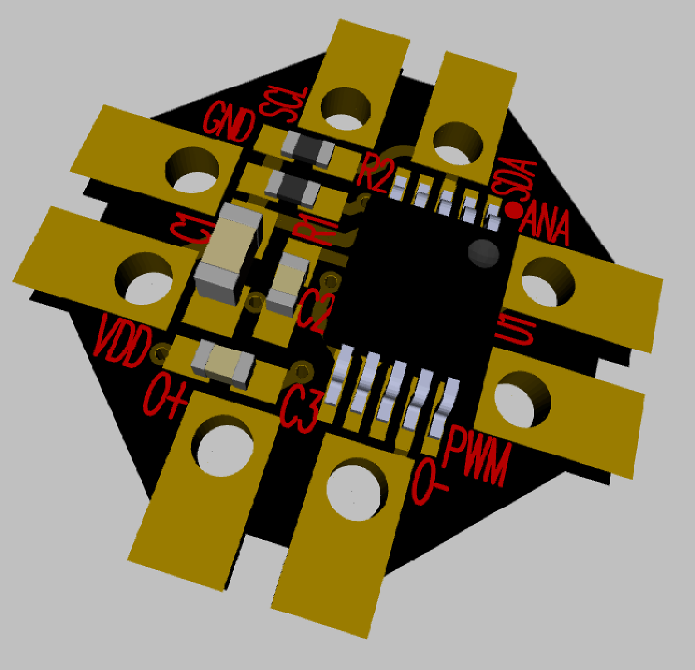
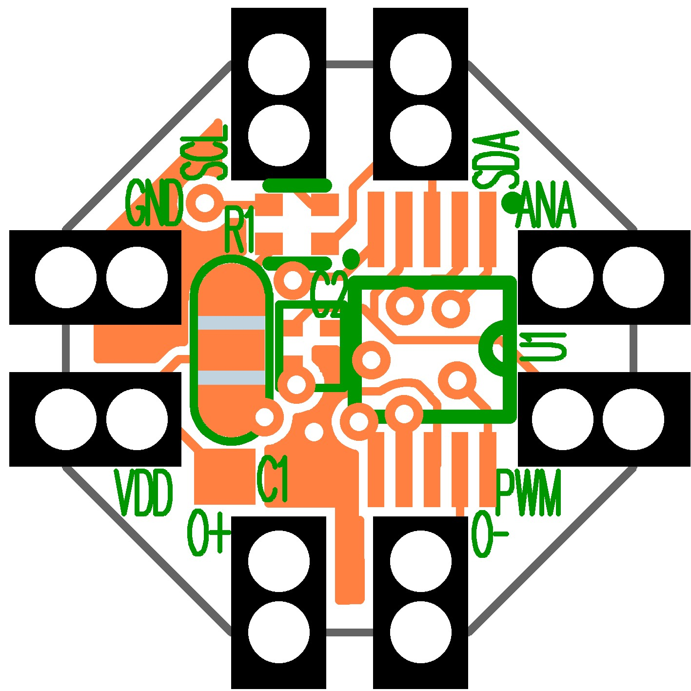
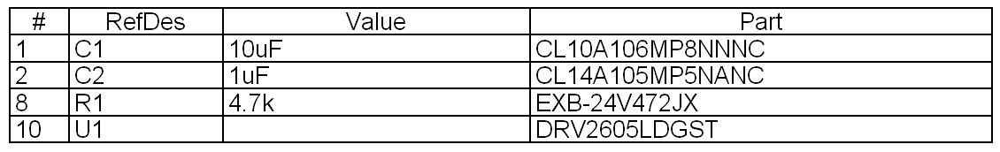
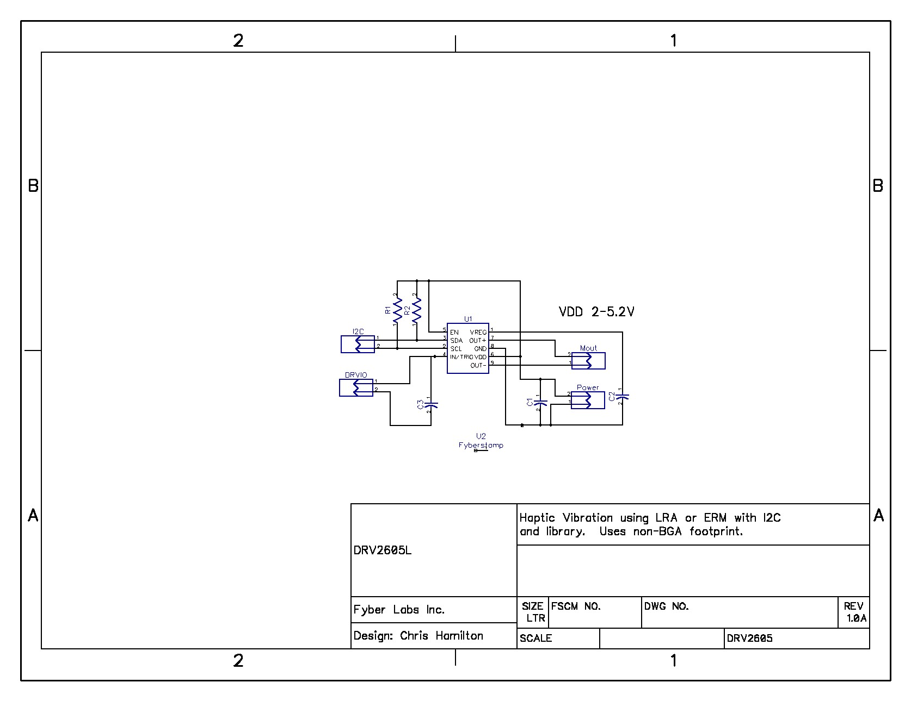

[Fyber Labs](https://www.fyberlabs.com) DRV2605L LRA Haptic Flex Module
========

### [**Buy this Flex Module now!**](https://www.tindie.com/products/Fyberlabs/lra-haptic-flex-module/)

A Flex Module is a tiny breakout board that is both breadboard-able and designed to solder/epoxy to flexible PCB for wearable prototyping.  The LRA Haptic Flex Module is based on the [**DRV2605L**](http://www.ti.com/product/DRV2605L) Haptic Driver.  The design is tiny to fit on the opposite side of a flexible circuit board from the ERM/LRA vibrator with a neoprene pad dampener.  The allows for maximum flexibility of the circuit.  It could also be attached directly to the motor, though durability would be limited.

The EN pin is tied to VDD so that only 8 pins are exposed. It fits perfectly on the back of a coin ERM or LRA motor.

This is the only breakout of the TI DRV2605 Haptic Driver for ERM/LRA with Built-In Library and Smart Loop Architecture available on the market with separate PWM and analog audio input.

This Flex Module will work with any ERM or LRA module sold by [Fyber Labs](https://www.fyberlabs.com).

## [->Project Blog](http://hackaday.io/project/2755-drv2605l-lra-driver-flex-module)
This is the hardware design repository from [Fyber Labs](https://www.fyberlabs.com).  Click on the link for 
more information on the ongoing development.

## [->Flex Modules Blog](https://hackaday.io/project/2236-flex-modules)
This project is part of the Flex Modules being developed for general wearable designs.  CLick on the 
link for more information about Flex Modules and demo projects utilizing Flex Modules like this.

## Layout:

## Bill Of Materials:

## Schematic:

## **Software available:**

- [Adafruit Arduino compatible](https://github.com/adafruit/Adafruit_DRV2605_Library)
- [Precision Microdrives Arduino compatible](http://www.precisionmicrodrives.com/haptics-haptic-feedback-vibration-alerting/haptic-feedback-evaluation-kit/code-and-arduino-sketches)
