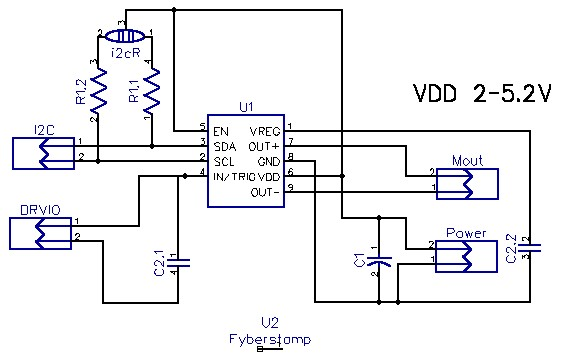

[Fyber Labs](https://www.fyberlabs.com) DRV2605L LRA Haptic Flex Module
========

[Order this Flex Module now.](https://www.tindie.com/products/Fyberlabs/lra-haptic-flex-module/)

This is a tiny breakout board updated for the DRV2605L Haptic Driver. It is castellated so that it may be utilized as a module on another circuit board or pins added for breadboard use. The design is tiny to fit on the opposite side of a flexible circuit board from the ERM/LRA vibrator with a neoprene pad dampener. The allows for maximum flexibility of the circuit. It could also be attached directly to the motor, though durability would be limited. (Vibration motor not included by default.)

The EN pin is tied to VDD so that only 8 pins are exposed. It fits perfectly on the back of a coin ERM or LRA motor.

This is the only breakout of the TI DRV2605 Haptic Driver for ERM/LRA with Built-In Library and Smart Loop Architecture available on the market with both PWM and analog audio input.

This Flex Module will work with any ERM or LRA module sold by [Fyber Labs](https://www.fyberlabs.com).

This is the hardware design repository from [Fyber Labs](https://www.fyberlabs.com).  For more information on
the ongoing development, please see the
[hackaday page](http://hackaday.io/project/2755-drv2605l-lra-driver-flex-module).
This project is part of the Flex Modules being developed
for general wearable designs.  For more information about Flex Modules and demo projects utilizing
Flex Modules like this, please see [the hackaday page](https://hackaday.io/project/2236-flex-modules).

Layout:

Bill Of Materials:

Schematic:

**Software available:**

- [Adafruit Arduino compatible](https://github.com/adafruit/Adafruit_DRV2605_Library)
- [Precision Microdrives Arduino compatible](http://www.precisionmicrodrives.com/haptics-haptic-feedback-vibration-alerting/haptic-feedback-evaluation-kit/code-and-arduino-sketches)
